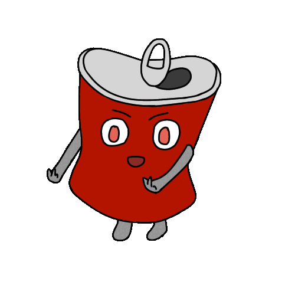
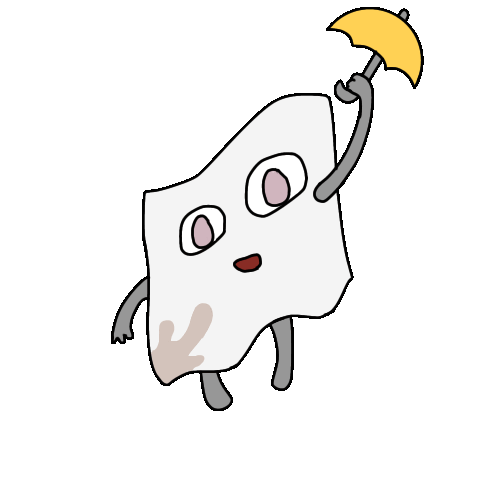
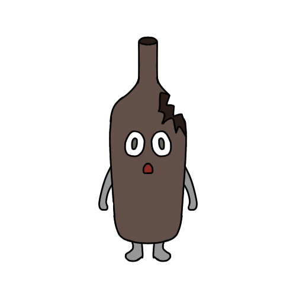

# ゴミ収集アドベンチャー 『ゴミンゴ』

## 製品概要

### 背景

日頃私たちがなかなか目を向けない「ゴミ問題」に、ゲームというエンターテイメントとしての入り口を用意することで、楽しく課題意識を育てたいと考えました。

### 製品説明

スマホカメラでゴミを撮影するだけで、ゴミの種類を自動で判別し、ゴミ拾いを楽しく行うことができるアプリです。

#### アプリ内 各画面について

- 『マップ』：ゴミ拾い実績とゴミ箱を表示します。
- 『焚き火』：このアプリのホーム画面。ゴミを拾ってそれを捨てることで、焚き火にキャラクターを登場させることができます。
- 『図鑑』：キャラクター実績が表示されます。ユーザはゴミ拾いを通じてキャラクターを集めることができます。

### 特長

#### 1. 日常にある「ゴミ拾い」が楽しく、可愛くできるアイディア

#### 2. 自動ゴミ判別・自動マップ登録など、ユーザにとって使いやすい機能

#### 3. "持続的"に社会環境の維持に貢献できる

### 解決できること

- ゴミ問題への課題意識を育てる
- ゲームを通じて、楽しくゴミ拾い・ゴミ捨てを行うことができる
- ゴミ拾いのデータを元に、**ゴミ発生の現状を可視化**することで自治体の持続的なゴミ問題解決に貢献する

### 今後の展望

- 「自治体モード」を追加し、ユーザが住んでいる自治体の分別方法で「燃えるゴミ」「燃えないゴミ」等を分類する機能を追加
- 自治体や不動産会社へ提供する、データベース機能の充実
- エッジケースへの対応

### 注力したこと（こだわり等）

- オリジナルの可愛いキャラクター
- ユーザへの負荷を軽減するためのさまざまな機能
  - AI ゴミ判別
  - 自動マップ登録
  - 自動認証機能

### キャラクター

## 開発技術

### 活用した技術

#### データセット

- [kaggle dataset]
  - Garbage Classification : https://www.kaggle.com/datasets/asdasdasasdas/garbage-classification?select=zero-indexed-files.txt
  - Garbage Classification(12 classes) : https://www.kaggle.com/datasets/mostafaabla/garbage-classification/data
  - images dataset : https://www.kaggle.com/datasets/pavansanagapati/images-dataset/data

#### フレームワーク・ライブラリ・モジュール

- Google Oauth
- PyTorch(ResNet50)
- Flask
- OpenCV
- React Native
- MySQL
- Docker

### 独自技術

#### ハッカソンで開発した独自機能・技術

- ディープラーニング (深層学習) による、ゴミ分類モデルの作成
  - **約 1 万枚の画像** を収集し、12 クラスに分類する分類モデルを作成
  - その学習済みモデルを使用し、ユーザが撮影したゴミの画像を分類します
  - モデルの学習コード：`./backend/model/train.py`

### 事前開発

- UI案
- プロトタイプ
- キャラクターデザイン

### Hack Day で開発した技術

- その他すべて

